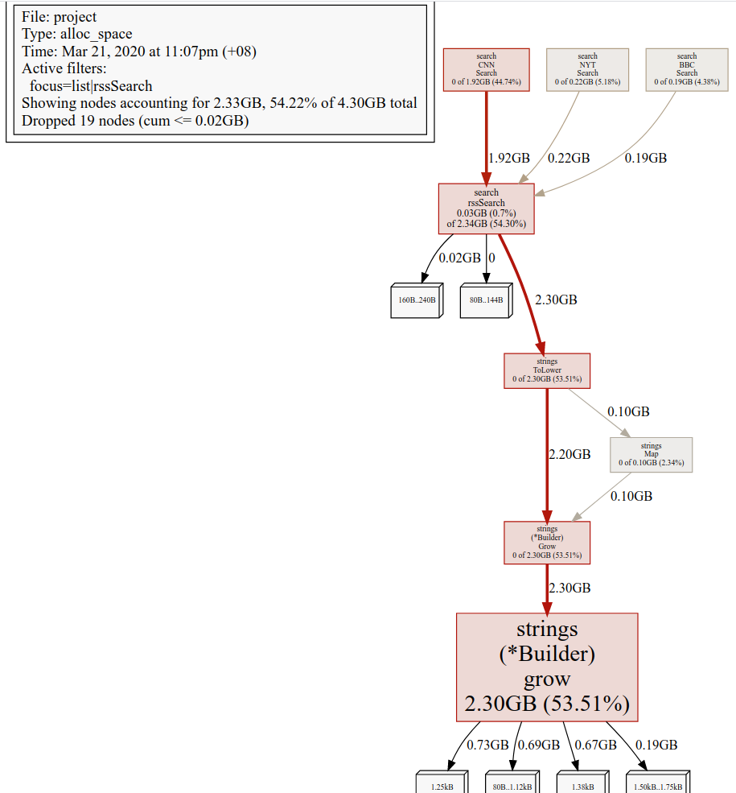
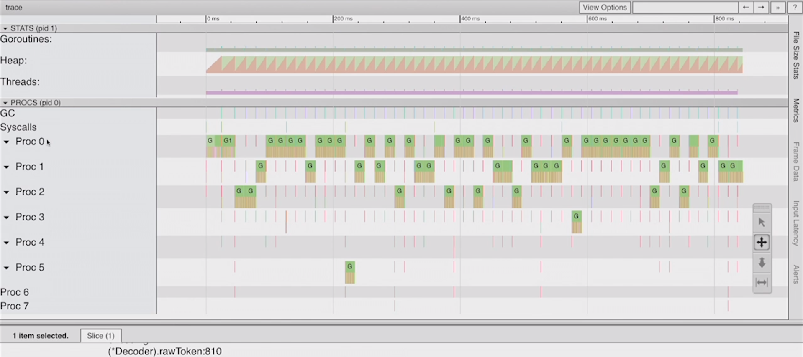
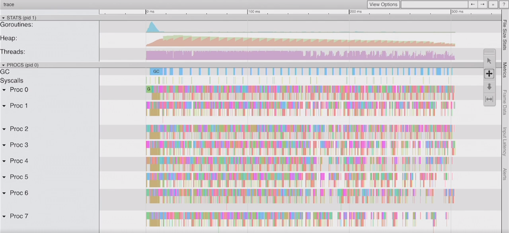
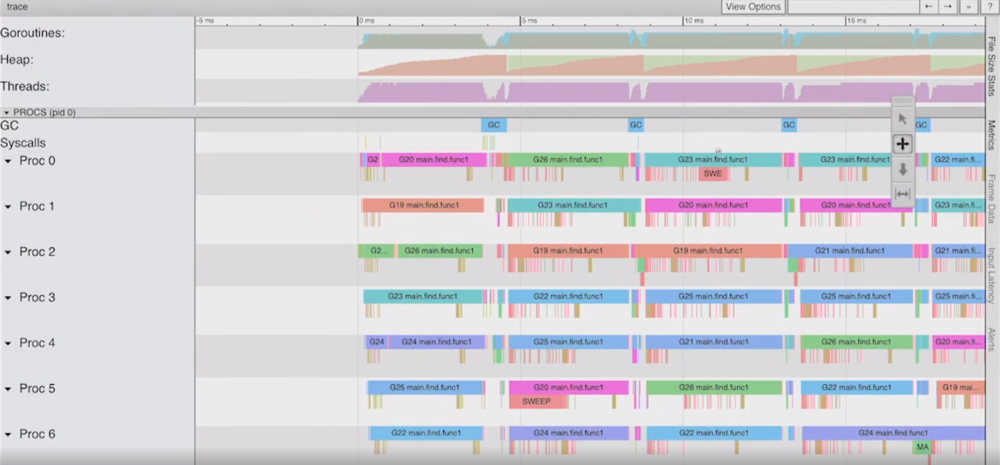

# Profiling and Tracing

## Profiling Guidelines

### The Basics of Profiling

> Those who can make you believe absurdities can make you commit atrocities - Voltaire

It's going back to the idea that you have to validate your results with the
profiling and the tracing. Don't get fooled and then make the wrong engineering
choices. In addition, we're now focusing not necessarily on optimizing for
correctness but now performance.

We've got a piece of software and we feel like it's not running fast enough at
this point. We want to understand why and try to make some changes to the code.

We will focus on two types of profiling; CPU level of profiling, and memory.
I'm not going to talk about blocking profiling and mutex profiling.

### How does a profiler work?

A profiler runs your program and configures the operating system to interrupt it at regular intervals. This is done by sending SIGPROF to the program being profiled, which suspends and transfers execution to the profiler. The profiler then grabs the program counter for each executing thread and restarts the program.

When we start using the profiler our program will run a little bit slower.
That's okay.

On a CPU perspective we're looking for the hot paths. Which functions are we
spending the most time in.
On the memory side, we should be looking for two things; the number of values
that we're throwing in the heap (number of objects, how short lived they are)
and overall heap size (how much memory do we actually need to store this amount
of data).

Performance improvements at a macro level: we're looking at allocations first.
At a micro level is usually where we start focusing on CPU performance.

### Profiling do's and don't's

Before you profile, you must have a stable environment to get repeatable results.

- The machine must be idle—don't profile on shared hardware, don't browse the web while waiting for a long benchmark to run.
- Watch out for power saving and thermal scaling.
- Avoid virtual machines and shared cloud hosting; they are too noisy for consistent measurements.

If you can afford it, buy dedicated performance test hardware. Rack them, disable all the power management and thermal scaling and never update the software on those machines.

For everyone else, have a before and after sample and run them multiple times to get consistent results.

### Types of Profiling

- CPU profiling
- Memory profiling
- Block profiling

**One profile at at time**
Profiling is not free. Profiling has a moderate, but measurable impact on program performance—especially if you increase the memory profile sample rate. Most tools will not stop you from enabling multiple profiles at once. If you enable multiple profiles at the same time, they will observe their own interactions and skew your results.

**Do not enable more than one kind of profile at a time.**

### Installing Tools

We will be using a tool called [hey](https://github.com/rakyll/hey), which is
written by JBD or Jaana.

**hey**
hey is a HTTP load generator, ApacheBench (ab) replacement, formerly known as
rakyll/boom. It's built using the Go language and leverages Goroutines for
behind the scenes async IO and concurrency.

	go get -u github.com/rakyll/hey

### Go and OS Tooling

#### time

The **time** command provide information that can help you get a sense how your program is performing.

#### perf

If you're a linux user, then perf(1) is a great tool for profiling applications. Now we have frame pointers, perf can profile Go applications.

## Basic Go Profiling

### Stack Traces

[Stack Traces and Core Dumps guide](stack_trace/README.md)

How to read stack traces?

[Review Stack Trace](stack_trace/example1/example1.go)

```go
package main

func main() {
    // We are making a slice of length 2, capacity 4 and then passing that
    // slice value into a function call example.
	// example takes a slice, a string, and an integer.
	example(make([]string, 2, 4), "hello", 10)
}

// examples call the built-in function panic to demonstrate the stack traces.
func example(slice []string, str string, i int) {
	panic("Want stack trace")
}
```

Output:

```sh
panic: Want stack trace

goroutine 1 [running]:
main.example(0xc00003a710, 0x2, 0x4, 0x47365d, 0x5, 0xa)
        /home/cedric/m/dev/work/repo/experiments/go/ultimate-go/profiling/stack_trace/example1/example1.go:15 +0x39
main.main()
        /home/cedric/m/dev/work/repo/experiments/go/ultimate-go/profiling/stack_trace/example1/example1.go:10 +0x72
exit status 2
```

Analysis:

We already know that the compiler tells us the lines of problems. That's good.
What is even better is that we know exactly what values are passed to the
function at the time stack traces occur. Stack traces show words of data at a
time.

We know that a slice is a 3-word data structure. In our case, 1st word is a
pointer, 2nd is 2 (length) and 3rd is 4 (capacity).
String is a 2-word data structure: a pointer and length of 5 because there are
5 bytes in string "hello".
Then we have a 1 word integer of value 10.

In the stack traces, main.example(0xc00003a710, 0x2, 0x4, 0x47365d, 0x5, 0xa),
the corresponding values in the function are address, 2, 4, address, 5, a (which
is 10 in base 2).

If we ask for the data we need, this is a benefit that we can get just by
looking at the stack traces and see the values that are going in. If we work
with the error package from Dave Cheney, wrap it and add more context, and log
package, we have more than enough information to debug a problem.

[Sample program](stack_trace/example2/example2.go) to show how to read a stack
trace when it packs values.

```go
func main() {
    // Passing values that are 1-byte values.
	example(true, false, true, 25)
}

func example(b1, b2, b3 bool, i uint8) {
	panic("Want stack trace")
}
```

Output:

```sh
panic: Want stack trace

goroutine 1 [running]:
main.example(0xc019010001)
        /home/cedric/m/dev/work/repo/experiments/go/ultimate-go/profiling/stack_trace/example2/example2.go:15 +0x39
main.main()
        /home/cedric/m/dev/work/repo/experiments/go/ultimate-go/profiling/stack_trace/example2/example2.go:10 +0x29
exit status 2
```

Analysis:

Since stack traces show 1 word at a time, all of these 4 bytes fit in a
half-word on a 32-bit platform and a full word on 64-bit. Also, the system we
are looking at is using little endian so we need to read from right to left.
In our case, the word value 0xc419010001 can be represented as:
```
Bits    Binary      Hex   Value
00-07   0000 0001   01    true
08-15   0000 0000   00    false
16-23   0000 0001   01    true
24-31   0001 1001   19    25
```

**Core Dump**

You can get to these core dumps, literally, by sending a signal quit to your
running Go application. If you think your Go application is deadlocked, if you
need to inspect what's going on, you send a signal quit to it.

You can do this by pressing (Ctrl+\\) on your keyboard. You will get a dump of
every Goroutine, and you'll be able to get what the registers are for that
thread, there, that's running on the Goroutine, and what's even more amazing is
if you use this environmental variable called `GOTRACEBACK`, and set it to
crash, then what happens is you'll get a full dump of not just your Goroutines,
but of the entire Go runtime, and everything that's happening, there.

[Sample program](stack_trace/example3/example3.go) that will allow us to explore how to look
at core dumps.

Build and run the example program.

```sh
$ go build
$ ./example3
```

Put some load of the web application.

```sh
$ hey -m POST -c 8 -n 1000000 "http://localhost:4000/sendjson"
```

Issue a signal quit.
```
Ctrl+\
```

Review the dump.

```sh
2020/03/21 00:09:06 listener : Started : Listening on: http://localhost:4000
^\SIGQUIT: quit
PC=0x45cec1 m=0 sigcode=128

goroutine 0 [idle]:
runtime.futex(0x95baa8, 0x80, 0x0, 0x0, 0x0, 0x0, 0x0, 0x0, 0x7ffd0258b338, 0x40bf8f, ...)
        /usr/local/go/src/runtime/sys_linux_amd64.s:535 +0x21
runtime.futexsleep(0x95baa8, 0x0, 0xffffffffffffffff)
        /usr/local/go/src/runtime/os_linux.go:44 +0x46
runtime.notesleep(0x95baa8)
        /usr/local/go/src/runtime/lock_futex.go:151 +0x9f
runtime.stopm()
        /usr/local/go/src/runtime/proc.go:1928 +0xc0
runtime.findrunnable(0xc000030f00, 0x0)
        /usr/local/go/src/runtime/proc.go:2391 +0x53f
runtime.schedule()
        /usr/local/go/src/runtime/proc.go:2524 +0x2be
runtime.park_m(0xc000072f00)
        /usr/local/go/src/runtime/proc.go:2610 +0x9d
runtime.mcall(0x0)
        /usr/local/go/src/runtime/asm_amd64.s:318 +0x5b

goroutine 1 [IO wait]:
internal/poll.runtime_pollWait(0x7fb892724f08, 0x72, 0x0)
        /usr/local/go/src/runtime/netpoll.go:184 +0x55
internal/poll.(*pollDesc).wait(0xc0000f4018, 0x72, 0x0, 0x0, 0x715e75)
        /usr/local/go/src/internal/poll/fd_poll_runtime.go:87 +0x45
internal/poll.(*pollDesc).waitRead(...)
        /usr/local/go/src/internal/poll/fd_poll_runtime.go:92
internal/poll.(*FD).Accept(0xc0000f4000, 0x0, 0x0, 0x0, 0x0, 0x0, 0x0, 0x0)
        /usr/local/go/src/internal/poll/fd_unix.go:384 +0x1f8
net.(*netFD).accept(0xc0000f4000, 0xc0000e7d18, 0x649f94, 0xc0000f20a0)
        /usr/local/go/src/net/fd_unix.go:238 +0x42
net.(*TCPListener).accept(0xc000096220, 0x5e74ed7c, 0xc0000e7d18, 0x4a5c06)
        /usr/local/go/src/net/tcpsock_posix.go:139 +0x32
net.(*TCPListener).Accept(0xc000096220, 0xc0000e7d68, 0x18, 0xc000000180, 0x64992e)
        /usr/local/go/src/net/tcpsock.go:261 +0x47
net/http.(*Server).Serve(0xc0000f2000, 0x77e680, 0xc000096220, 0x0, 0x0)
        /usr/local/go/src/net/http/server.go:2896 +0x286
net/http.(*Server).ListenAndServe(0xc0000f2000, 0xc0000f2000, 0x1)
        /usr/local/go/src/net/http/server.go:2825 +0xb7
net/http.ListenAndServe(...)
        /usr/local/go/src/net/http/server.go:3080
main.main()
        /home/cedric/m/dev/work/repo/experiments/go/ultimate-go/profiling/stack_trace/example3/example3.go:20 +0xf2

...

rax    0xca
rbx    0x95b960
rcx    0x45cec3
rdx    0x0
rdi    0x95baa8
rsi    0x80
rbp    0x7ffd0258b300
rsp    0x7ffd0258b2b8
r8     0x0
r9     0x0
r10    0x0
r11    0x286
r12    0xf2
r13    0x0
r14    0x7702a6
r15    0x0
rip    0x45cec1
rflags 0x286
cs     0x33
fs     0x0
gs     0x0
```

Get a larger crash dump by running the program using the `GOTRACEBACK` env
variable.

```sh
$ GOTRACEBACK=crash ./example3
```

On Linux, there's a tool called `gcore`, and we can use `gcore` to get a dump of
a running Go program.

```sh
# sudo gcore -o core.txt PID
$ sudo gcore -o core.txt 695
[sudo] password for cedric:
[New LWP 696]
[New LWP 697]
[New LWP 698]
[New LWP 699]
[New LWP 700]
[New LWP 701]
warning: File "/usr/local/go/src/runtime/runtime-gdb.py" auto-loading has been declined by your `auto-load safe-path' set to "$debugdir:$datadir/auto-load".
To enable execution of this file add
	add-auto-load-safe-path /usr/local/go/src/runtime/runtime-gdb.py
line to your configuration file "/home/cedric/.gdbinit".
To completely disable this security protection add
	set auto-load safe-path /
line to your configuration file "/home/cedric/.gdbinit".
For more information about this security protection see the
"Auto-loading safe path" section in the GDB manual.  E.g., run from the shell:
	info "(gdb)Auto-loading safe path"
[Thread debugging using libthread_db enabled]
Using host libthread_db library "/lib/x86_64-linux-gnu/libthread_db.so.1".
runtime.epollwait () at /usr/local/go/src/runtime/sys_linux_amd64.s:673
673		MOVL	AX, ret+24(FP)
Saved corefile core.txt.695
[Inferior 1 (process 695) detached]
```

Use [Delve](https://github.com/go-delve/delve) to review the dump.

```sh
$ dlv core ./godebug core.txt

# bt command print stack trace
(dlv) bt
0  0x000000000045d070 in runtime.epollwait
   at /usr/local/go/src/runtime/sys_linux_amd64.s:673
1  0x000000000042bfb0 in runtime.netpoll
   at /usr/local/go/src/runtime/netpoll_epoll.go:71
2  0x00000000004356c5 in runtime.findrunnable
   at /usr/local/go/src/runtime/proc.go:2372
3  0x000000000043639e in runtime.schedule
   at /usr/local/go/src/runtime/proc.go:2524
4  0x00000000004366dd in runtime.park_m
   at /usr/local/go/src/runtime/proc.go:2610
5  0x0000000000458ecb in runtime.mcall
   at /usr/local/go/src/runtime/asm_amd64.s:318

# ls command show source code
(dlv) ls
> runtime.epollwait() /usr/local/go/src/runtime/sys_linux_amd64.s:673 (PC: 0x45d070)
Warning: debugging optimized function
   668:		MOVL	nev+16(FP), DX
   669:		MOVL	timeout+20(FP), R10
   670:		MOVQ	$0, R8
   671:		MOVL	$SYS_epoll_pwait, AX
   672:		SYSCALL
=> 673:		MOVL	AX, ret+24(FP)
   674:		RET
   675:
   676:	// void runtime·closeonexec(int32 fd);
   677:	TEXT runtime·closeonexec(SB),NOSPLIT,$0
   678:		MOVL    fd+0(FP), DI  // fd
```

### Micro Level Optimizations using Benchmarks

I will show you how to leverage benchmarks to do micro level optimizations.
I call this micro level because we will be focusing on like a single function,
trying to make it run faster either by looking at CPU changes, or by trying to
leverage memory.

Example: One day I decided that I wanted to learn more about the io package,
I don't get to do streaming data. So, I came up with this scenario. Let's
pretend that a stream of bytes is coming over the wire and that stream has the
name Elvis inside of it. Elvis' name should always be capital. This program will
scour the Internet byte by byte and fix anything that doesn't have the name as a
capital E.

[Sample program](memcpu/stream.go).

```go
// data represents a table of input and expected output.
var data = []struct {
	input  []byte
	output []byte
}{
	{[]byte("abc"), []byte("abc")},
	{[]byte("elvis"), []byte("Elvis")},
	{[]byte("aElvis"), []byte("aElvis")},
	{[]byte("abcelvis"), []byte("abcElvis")},
	{[]byte("eelvis"), []byte("eElvis")},
	{[]byte("aelvis"), []byte("aElvis")},
	{[]byte("aabeeeelvis"), []byte("aabeeeElvis")},
	{[]byte("e l v i s"), []byte("e l v i s")},
	{[]byte("aa bb e l v i saa"), []byte("aa bb e l v i saa")},
	{[]byte(" elvi s"), []byte(" elvi s")},
	{[]byte("elvielvis"), []byte("elviElvis")},
	{[]byte("elvielvielviselvi1"), []byte("elvielviElviselvi1")},
	{[]byte("elvielviselvis"), []byte("elviElvisElvis")},
}

// assembleInputStream combines all the input into a
// single stream for processing.
func assembleInputStream() []byte {
	var in []byte
	for _, d := range data {
		in = append(in, d.input...)
	}
	return in
}

// assembleOutputStream combines all the output into a
// single stream for comparing.
func assembleOutputStream() []byte {
	var out []byte
	for _, d := range data {
		out = append(out, d.output...)
	}
	return out
}

func main() {
	var output bytes.Buffer
	in := assembleInputStream()
	out := assembleOutputStream()

	find := []byte("elvis")
	repl := []byte("Elvis")

	fmt.Println("=======================================\nRunning Algorithm One")
	output.Reset()
	algOne(in, find, repl, &output)
	matched := bytes.Compare(out, output.Bytes())
	fmt.Printf("Matched: %v\nInp: [%s]\nExp: [%s]\nGot: [%s]\n", matched == 0, in, out, output.Bytes())

	fmt.Println("=======================================\nRunning Algorithm Two")
	output.Reset()
	algTwo(in, find, repl, &output)
	matched = bytes.Compare(out, output.Bytes())
	fmt.Printf("Matched: %v\nInp: [%s]\nExp: [%s]\nGot: [%s]\n", matched == 0, in, out, output.Bytes())
}

// algOne is one way to solve the problem.
func algOne(data []byte, find []byte, repl []byte, output *bytes.Buffer) {
    // truncated. see stream.go file for full source code.
}

// algTwo is a second way to solve the problem.
// Provided by Tyler Stillwater https://twitter.com/TylerStillwater
func algTwo(data []byte, find []byte, repl []byte, output *bytes.Buffer) {
    // truncated. see stream.go file for full source code.
}
```

Then I just build this program and I run it we see that my algorithm works and
his algorithm works. So I go ahead and I wrote two [benchmark functions](memcpu/stream_test.go).

Run the benchmark.

```sh
$ go test -run none -bench . -benchtime 3s -benchmem
```

Sample output:

```sh
goos: linux
goarch: amd64
pkg: github.com/cedrickchee/ultimate-go/profiling/memcpu
BenchmarkAlgorithmOne-4           942938              3205 ns/op              53 B/op          2 allocs/op
BenchmarkAlgorithmTwo-4          4850488               763 ns/op               0 B/op          0 allocs/op
PASS
ok      github.com/cedrickchee/ultimate-go/profiling/memcpu     7.520s
```

`53 B/op    2 allocs/op`:  We had two values end up on the heap worth 53 bytes.

AlgorithmTwo ran almost 5 times faster than AlgorithmOne did and a zero
allocation algorithm.

I want to know where these allocations are coming from. I want to know if I can
make my algorithm go faster yet keep the spirit of the algorithm in place.

We always go after allocations first for performance, then we can look at look
at algorithm efficiencies for the CPU side. I need a profile, a memory profile
of this particular benchmark.

[video timecode 7:09]: I can do that on the command line by following the instructions in this
[benchmark profiling guide](memcpu/README.md).

<!--Summary:
- compare perf of 2 different version of the same app
  - by Bill
  - by another Go developer
  - Benchmark
- First focus on memory allocation
  - reduce that
- Then, focus on CPU usage
  - reduce that
- Escape analysis
  - memory allocation
- go tool
  - pprof-->

### Macro Level Optimization: GODEBUG Tracing

We're looking for the low-hanging fruit.

What I've done here is I've got a project already, which is web app, it has a
whole browser-based front-end.

[Profiling a Larger Web Service/Real World App Guide](project/README.md) | [Web App Code](project/main.go)

We plan to take this to production, but we want to get a general understanding
if this is healthy and if there's anything that we maybe can fix in terms of
allocations or CPU performance. So we want to run this server under load, and
then we want to be able to eventually take some profiling.

But even if we don't want profiling right now, I want to at least be able to get
a sense of the health of this, both from the scheduling side and from the memory
side.

I can do that by using the `GODEBUG` variable.

[GODEBUG guide](godebug/README.md)

We are using a special environmental variable called `GODEBUG`.
It gives us the ability to do a memory trace and a scheduler trace.

#### Schedule Tracing

**Generating a Scheduler Trace**

Run the example program:

Note: ` > /dev/null` make sure that anything writing to standard out kind of
disappears. I don't want the standard out to interfere with our traces. The
`GODEBUG` writes traces to standard error.

```sh
# redirect stdout to /dev/null device
$ GODEBUG=schedtrace=1000 ./project > /dev/null

SCHED 10065ms: gomaxprocs=8 idleprocs=8 threads=10 spinningthreads=0 idlethreads=3 runqueue=0 [0 0 0 0 0 0 0 0]
SCHED 11068ms: gomaxprocs=8 idleprocs=8 threads=10 spinningthreads=0 idlethreads=3 runqueue=0 [0 0 0 0 0 0 0 0]
... ... snipped ... ...
```

So this is running every second.

I'm getting scheduler stats. This is only going to show goroutines that are
executing or in a runnable state. Goroutines that are waiting, disappear.

```
You're seeing scheduler stats that followed this pattern:

    SCHED {0}ms: gomaxprocs={1} idleprocs={2} threads={3} spinningthreads={4} idlethreads={5} runqueue={6} [{7}]

    where:
        {0} : what time it was when we ran this trace
        {1} : number of procs/threads we're using
        {2} : number of procs that are idle
        {3} : total number of OS threads we have now
        {4} : spinning mean that there's proc that has no work to do and it's
              looking to steal work or it's just trying to keep that thread busy
              so it doesn't context switch off the core
        {5} : idle threads
        {6} : number of goroutine in the global run queue that weren't taken yet
              for work
        {7} : distribution of goroutines in a runnable state that are waiting
              in the local run queue per "P"
```

Next, put some load of the web application.
I've already set up the `hey` tool to do a POST call over 100 concurrent
connections.

```sh
$ hey -m POST -c 8 -n 1000000 "http://localhost:4000/sendjson"
```

Look at the load on the logical processor. We can only see runnable goroutines.
After 5 seconds we don't see any more goroutines in the trace.

```sh
SCHED 8047ms: gomaxprocs=1 idleprocs=0 threads=4 spinningthreads=0 idlethreads=1 runqueue=0 [62]
SCHED 9056ms: gomaxprocs=1 idleprocs=0 threads=4 spinningthreads=0 idlethreads=1 runqueue=32 [0]
SCHED 10065ms: gomaxprocs=1 idleprocs=1 threads=4 spinningthreads=0 idlethreads=1 runqueue=0 [0]
SCHED 11068ms: gomaxprocs=1 idleprocs=1 threads=4 spinningthreads=0 idlethreads=1 runqueue=0 [0]
```

We wouldn't see goroutine leaks here, because a goroutine leak would mean that a
goroutine is in a waiting state, usually and that means that it wouldn't show up.

#### GC Tracing

But, now I want to look at our CPU and memory profile.

GC/memory tracing gives us a general idea if our software is healthy as related
to the GC and memory in the heap that we are working with.

We will ask for the garbage collection (GC) trace everytime a GC starts.

```sh
$ GODEBUG=gctrace=1 ./project > /dev/null

gc 318 @36.750s 0%: 0.022+0.27+0.040 ms clock, 0.13+0.60/0.43/0.031+0.24 ms cpu, 4->4->0 MB, 5 MB goal, 8 P
gc 319 @36.779s 0%: 0.019+0.24+0.035 ms clock, 0.15+0.43/0.26/0+0.28 ms cpu, 4->4->0 MB, 5 MB goal, 8 P
... ... snipped ... ...
```

The format of this line:

```sh
gc # @#s #%: #+...+# ms clock, #+...+# ms cpu, #->#-># MB, # MB goal, # P
```

Where the fields are as follows:

```
gc #        the GC number, incremented at each GC
@#s         time in seconds since program start
#%          percentage of time spent in GC since program start
#+...+#     wall-clock/CPU times for the phases of the GC
            1st phase (stop-the-world time): trying to bring those Ps to a safe point
            2nd phase (concurrent time for wall-clock): which hopefully the bulk of it
            2nd phase (concurrent time for CPU): is broken into 3 phases
            3rd phase (stop-the-world time): as relates to the clean up
#->#-># MB  heap size at GC start, at GC end, and live heap
# MB goal   goal heap size
# P         number of logical processors used
```

**wall-clock** time is a measure of the real time that elapses from start to end, including time that passes due to programmed (artificial) delays or waiting for resources to become available.
https://en.wikipedia.org/wiki/Wall-clock_time

**CPU time** (or process time) is the amount of time for which a central processing unit (CPU) was used for processing instructions of a computer program or operating system, as opposed to, for example, waiting for input/output (I/O) operations or entering low-power (idle) mode.
https://en.wikipedia.org/wiki/CPU_time

GC time for 1st phase (stop-the-world time) should never add up to be more than 100 microseconds. It might happen a few times when we're growing the heap, but overall it shouldn't. So, we will look at this and make sure that we're healthy in terms of stop the world latency.

`GC forced`: If the program is idle enough, then the GC will force itself to run.
You can see that we've knocked the heap down from 4 to 3 meg. If you think you
have a memory leak, I will ask you to run this GC trace, because this is the
only way to really know if we're leaking memory in the heap.

What you also see is the scavenger. The scavenger runs in the background trying
to release memory back to the OS. We haven't released anything back because our
heap is very small.

**Generating a GC Trace**

Put some load of the web application.

```sh
$ hey -m POST -c 8 -n 1000000 "http://localhost:4000/sendjson"
```

Review the GC trace.

You can see that there's a lot of GC going on, but you shouldn't panic about
this. A busy Go program is probably will have a GC pace of a millisecond or two,
we can look at what the pace was, because we're trying to maintain the smallest
heap possible, running at a reasonable pace, where our GC latency times are
100 microseconds, or less.

```sh
gc 318 @36.750s 0%: 0.022+0.27+0.040 ms clock, 0.13+0.60/0.43/0.031+0.24 ms cpu, 4->4->0 MB, 5 MB goal, 8 P
gc 319 @36.779s 0%: 0.019+0.24+0.035 ms clock, 0.15+0.43/0.26/0+0.28 ms cpu, 4->4->0 MB, 5 MB goal, 8 P
gc 320 @36.806s 0%: 0.023+0.34+0.035 ms clock, 0.18+0.63/0.49/0.014+0.28 ms cpu, 4->4->0 MB, 5 MB goal, 8 P
gc 321 @36.834s 0%: 0.026+0.20+0.044 ms clock, 0.18+0.50/0.34/0.001+0.31 ms cpu, 4->4->0 MB, 5 MB goal, 8 P
gc 322 @36.860s 0%: 0.022+0.29+0.055 ms clock, 0.13+0.54/0.47/0+0.33 ms cpu, 4->4->0 MB, 5 MB goal, 8 P

gc 318      : First GC run since program started.
@36.750s    : Nine milliseconds since the program started.
0%          : One percent of the programs time has been spent in GC.

// wall-clock
0.022ms     : **STW** Sweep termination - Wait for all Ps to reach a GC safe-point.
0.27ms      : Mark/Scan
0.040ms     : **STW** Mark termination - Drain any remaining work and perform housekeeping.

// CPU time
0.13ms      : **STW** Sweep termination - Wait for all Ps to reach a GC safe-point.
0.60ms      : Mark/Scan - Assist Time (GC performed in line with allocation)
0.43ms      : Mark/Scan - Background GC time
0.031ms     : Mark/Scan - Idle GC time
0.24ms      : **STW** Mark termination - Drain any remaining work and perform housekeeping.

4MB         : Heap size at GC start
4MB         : Heap size at GC end
0MB         : Live Heap
5MB         : Goal heap size
8P          : Number of logical processors
```

Go through heap profile lines. We see a lot of heap growth. Maybe we're
over-allocating somewhere where we shouldn't. We are still running at a nice
pace, but seeing a lot of fluctuations on the heap.

What this heap profile is telling me is I want to investigate this piece of
software more. The only way to investigate this more now, is to try to get a
memory profile out of the app. So the next step now is to get a memory, and
eventually a CPU profile to see if we can improve its performance.

**Memory leak example**

Below is a sample program that causes memory leak that we can use `GODEBUG` to
understand what's going on.

```go
import (
	"os"
	"os/signal"
)

func main() {
    // Create a Goroutine that leaks memory. Dumping key-value pairs to put
    // tons of allocation.
	go func() {
		m := make(map[int]int)

		for i := 0; ; i++ {
			m[i] = i
		}
	}()

	// Shutdown the program with Ctrl-C
	sig := make(chan os.Signal, 1)
	signal.Notify(sig)
	<-sig
}
```

Here are the steps to build and run:

Build the program by: `go build memory_tracing.go`.
Run the binary: `GODEBUG=gctrace=1 ./memory_tracing`.

Setting the `GODEBUG=gctrace=1` causes the GC to emit a single line to standard
error at each collection, summarizing the amount of memory collected and the
length of the pause.

What we will see are bad traces followed by this pattern:

```
    gc {0} @{1}s {2}%: {3}+...+{4} ms clock, {5}+...+{6} ms cpu, {7}->{8}->{9} MB, {10} MB goal, {11} P

    where:
        {0} : The number of times gc run
        {1} : The amount of time the program has been running.
        {2} : The percentage of CPU the gc is taking away from us.
        {3} : Stop of wall clock time - a measure of the real time including time that passes due to programmed
              delays or waiting for resources to become available.
        {4} : Stop of wall clock. This is normally a more important number to look at.
        {5} : CPU clock
        {6} : CPU clock
        {7} : The size of the heap prior to the gc starting.
        {8} : The size of the heap after the gc run.
        {9} : The size of the live heap.
        {10}: The goal of the gc, pacing algorithm.
        {11}: The number of processes.
```

For example:

```sh
gc 1 @0.007s 0%: 0.010+0.13+0.030 ms clock, 0.080+0/0.058/0.15+0.24 ms cpu, 5->5->3 MB, 6 MB goal, 8 P
gc 2 @0.013s 0%: 0.003+0.21+0.034 ms clock, 0.031+0/0.030/0.22+0.27 ms cpu, 9->9->7 MB, 10 MB goal, 8 P
gc 3 @0.029s 0%: 0.003+0.23+0.030 ms clock, 0.029+0.050/0.016/0.25+0.24 ms cpu, 18->18->15 MB, 19 MB goal, 8 P
gc 4 @0.062s 0%: 0.003+0.40+0.040 ms clock, 0.030+0/0.28/0.11+0.32 ms cpu, 36->36->30 MB, 37 MB goal, 8 P
gc 5 @0.135s 0%: 0.003+0.63+0.045 ms clock, 0.027+0/0.026/0.64+0.36 ms cpu, 72->72->60 MB, 73 MB goal, 8 P
gc 6 @0.302s 0%: 0.003+0.98+0.043 ms clock, 0.031+0.078/0.016/0.88+0.34 ms cpu, 65->66->42 MB, 120 MB goal, 8 P
gc 7 @0.317s 0%: 0.003+1.2+0.080 ms clock, 0.026+0/1.1/0.13+0.64 ms cpu, 120->121->120 MB, 121 MB goal, 8 P
gc 8 @0.685s 0%: 0.004+1.6+0.041 ms clock, 0.032+0/1.5/0.72+0.33 ms cpu, 288->288->241 MB, 289 MB goal, 8 P
gc 9 @1.424s 0%: 0.004+4.0+0.081 ms clock, 0.033+0.027/3.8/0.53+0.65 ms cpu, 577->577->482 MB, 578 MB goal, 8 P
gc 10 @2.592s 0%: 0.003+11+0.045 ms clock, 0.031+0/5.9/5.2+0.36 ms cpu, 499->499->317 MB, 964 MB goal, 8 P
```

### Macro Level Optimization: Memory Profiling

Go makes it very easy for us to get a memory profile out of a running Go program.

I will show you that with a production level project.

[pprof profiling guide](pprof/README.md).

[Sample code from service repo](https://github.com/ardanlabs/service/blob/master/cmd/sales-api/main.go)

```go
import _ "net/http/pprof" // Register the pprof handlers

// ... truncated for brevity ...

func run() error {
    // ... truncated for brevity ...

    // =========================================================================
	// Start Debug Service
	//
	// /debug/pprof - Added to the default mux by importing the net/http/pprof package.
	// /debug/vars - Added to the default mux by importing the expvar package.
	//
	// Not concerned with shutting this down when the application is shutdown.

	log.Println("main : Started : Initializing debugging support")

	go func() {
		log.Printf("main : Debug Listening %s", cfg.Web.DebugHost)
		log.Printf("main : Debug Listener closed : %v", http.ListenAndServe(cfg.Web.DebugHost, http.DefaultServeMux))
    }()

    // ... truncated for brevity ...
}
```

What we're going to do is bind the `DefaultServeMux` to a localhost port and
using `ListenAndServe` to host the `DefaultServeMux` on that port. What's going
to happen is this, all I've got to do is import pprof `import _ "net/http/pprof"`.
By using the blank identifier `_`, what this means is, "hey, there's an init
function in here that is binding a route to the `DefaultServerMux`". So when I
bind it, I'm going to have some routes that give me back CPU and memory
profiles. I get this all for free.

Let's profile the web service. The following steps are based on this [guide](project/README.md).

```sh
~/m/dev/work/repo/experiments/go/ultimate-go/profiling/project
$ go build
# $ ./project
# 2020/03/21 22:20:29.259919 service.go:64: Listening on: 0.0.0.0:5000
# Open this URL in your browser: http://localhost:5000/search

# GC trace
$ GODEBUG=gctrace=1 ./project > /dev/null
gc 1 @9.761s 0%: 0.017+1.2+0.008 ms clock, 0.068+1.2/0.79/1.5+0.032 ms cpu, 4->4->1 MB, 5 MB goal, 4 P
gc 2 @9.784s 0%: 0.013+2.4+0.011 ms clock, 0.054+0.36/2.1/0.31+0.047 ms cpu, 4->4->1 MB, 5 MB goal, 4 P
...

# Adding load
$ hey -m POST -c 100 -n 10000 "http://localhost:5000/search?term=covid-19&cnn=on&bbc=on&nyt=on"

Summary:
  Total:	23.1709 secs
  Slowest:	2.1538 secs
  Fastest:	0.0023 secs
  Average:	0.2092 secs
  Requests/sec:	431.5751

Response time histogram:
  0.002 [1]	|
  0.217 [6677]	|■■■■■■■■■■■■■■■■■■■■■■■■■■■■■■■■■■■■■■■■
  0.433 [1457]	|■■■■■■■■■
  0.648 [916]	|■■■■■
  0.863 [527]	|■■■
  1.078 [237]	|■
  1.293 [103]	|■
  1.508 [54]	|
  1.723 [18]	|
  1.939 [8]	|
  2.154 [2]	|


Latency distribution:
  10% in 0.0057 secs
  25% in 0.0110 secs
  50% in 0.0410 secs
  75% in 0.3295 secs
  90% in 0.6346 secs
  95% in 0.8231 secs
  99% in 1.2317 secs

Details (average, fastest, slowest):
  DNS+dialup:	0.0001 secs, 0.0023 secs, 2.1538 secs
  DNS-lookup:	0.0000 secs, 0.0000 secs, 0.0240 secs
  req write:	0.0001 secs, 0.0000 secs, 0.0164 secs
  resp wait:	0.2081 secs, 0.0020 secs, 2.1536 secs
  resp read:	0.0009 secs, 0.0000 secs, 0.0504 secs

Status code distribution:
  [200]	10000 responses
```

```sh
$ GODEBUG=gctrace=1 ./project > /dev/null
...
gc 732 @354.731s 1%: 8.0+28+2.5 ms clock, 32+2.4/18/0+10 ms cpu, 7->10->5 MB, 9 MB goal, 4 P
gc 733 @354.780s 1%: 0.21+37+0.025 ms clock, 0.87+1.9/6.2/9.4+0.10 ms cpu, 8->13->7 MB, 11 MB goal, 4 P
```

We know that we're running at 431 requests a second, which took us a total of
733 garbage collections, to make that happen.

#### PPROF

**Raw http/pprof**

Look at the basic profiling stats from the new endpoint:

    http://localhost:5000/debug/pprof/

```
debug/pprof/

Types of profiles available:
Count	Profile
198	allocs
0	block
0	cmdline
8	goroutine
198	heap
0	mutex
0	profile
18	threadcreate
0	trace
full goroutine stack dump

Profile Descriptions:

    - allocs: A sampling of all past memory allocations
    - block: Stack traces that led to blocking on synchronization primitives
    - cmdline: The command line invocation of the current program
    - goroutine: Stack traces of all current goroutines
    - heap: A sampling of memory allocations of live objects. You can specify the gc GET parameter to run GC before taking the heap sample.
    ... ... truncated ... ...
```

Capture allocs profile:

    http://localhost:5000/debug/pprof/allocs?debug=1

```
// these are raw heap data

heap profile: 2: 5504 [8740: 73829968] @ heap/1048576
1: 4096 [1: 4096] @ 0x4332ab 0x43a1e7 0x45d5ff 0x45e316 0x4350a0
#	0x4332aa	runtime.allgadd+0xda		/usr/local/go/src/runtime/proc.go:471
#	0x43a1e6	runtime.newproc1+0x486		/usr/local/go/src/runtime/proc.go:3287
#	0x45d5fe	runtime.newproc.func1+0x4e	/usr/local/go/src/runtime/proc.go:3256
#	0x45e315	runtime.systemstack+0x65	/usr/local/go/src/runtime/asm_amd64.s:370
#	0x4350a0	runtime.mstart+0x0		/usr/local/go/src/runtime/proc.go:1146

1: 1408 [1: 1408] @ 0x5f2cf2 0x5f5088 0x5e7eff 0x5e97e7 0x5e9196 0x46ebb3 0x5edb75 0x5edaac 0x5edabb 0x61f408 0x61d6f7 0x61bc2b 0x61a30a 0x6188fb 0x6ffa32 0x460371
#	0x5f2cf1	crypto/x509.parseCertificate+0x41				/usr/local/go/src/crypto/x509/x509.go:1388
#	0x5f5087	crypto/x509.ParseCertificate+0xf7				/usr/local/go/src/crypto/x509/x509.go:1621
#	0x5e7efe	crypto/x509.(*CertPool).AppendCertsFromPEM+0xee			/usr/local/go/src/crypto/x509/cert_pool.go:139
#	0x5e97e6	crypto/x509.loadSystemRoots+0x5b6				/usr/local/go/src/crypto/x509/root_unix.go:51
#	0x5e9195	crypto/x509.initSystemRoots+0x25				/usr/local/go/src/crypto/x509/root.go:21
#	0x46ebb2	sync.(*Once).doSlow+0xe2					/usr/local/go/src/sync/once.go:66
... ... truncated ... ...
```

Capture heap profile:

	http://localhost:5000/debug/pprof/heap

Capture cpu profile:

	http://localhost:5000/debug/pprof/profile


**Interactive Profiling**

Run the Go pprof tool in another window or tab to review alloc space heap
information.

```sh
$ go tool pprof -alloc_space http://localhost:5000/debug/pprof/allocs

Fetching profile over HTTP from http://localhost:5000/debug/pprof/allocs
Saved profile in /home/cedric/pprof/pprof.project.alloc_objects.alloc_space.inuse_objects.inuse_space.001.pb.gz
File: project
Type: alloc_space
Time: Mar 21, 2020 at 11:07pm (+08)
Entering interactive mode (type "help" for commands, "o" for options)
```

The following give me the top 40 functions, cumulative.

```sh
(pprof) top 40 -cum
Showing nodes accounting for 4242.38MB, 96.30% of 4405.46MB total
Dropped 117 nodes (cum <= 22.03MB)
Showing top 40 nodes out of 49
      flat  flat%   sum%        cum   cum%
   31.01MB   0.7%   0.7%  2392.07MB 54.30%  github.com/cedrickchee/ultimate-go/profiling/project/search.rssSearch
         0     0%   0.7%  2357.53MB 53.51%  strings.(*Builder).Grow
 2357.53MB 53.51% 54.22%  2357.53MB 53.51%  strings.(*Builder).grow
         0     0% 54.22%  2357.53MB 53.51%  strings.ToLower
   11.51MB  0.26% 54.48%  1982.51MB 45.00%  github.com/cedrickchee/ultimate-go/profiling/project/search.CNN.Search
         0     0% 54.48%  1982.25MB 45.00%  net/http.(*conn).serve
  189.15MB  4.29% 58.77%  1965.74MB 44.62%  github.com/cedrickchee/ultimate-go/profiling/project/service.handler
         0     0% 58.77%  1965.74MB 44.62%  github.com/braintree/manners.(*gracefulHandler).ServeHTTP
         0     0% 58.77%  1965.74MB 44.62%  net/http.(*ServeMux).ServeHTTP
         0     0% 58.77%  1965.74MB 44.62%  net/http.HandlerFunc.ServeHTTP
         0     0% 58.77%  1965.74MB 44.62%  net/http.serverHandler.ServeHTTP
  409.93MB  9.30% 68.08%  1743.05MB 39.57%  github.com/cedrickchee/ultimate-go/profiling/project/service.render
       1MB 0.023% 68.10%  1333.12MB 30.26%  github.com/cedrickchee/ultimate-go/profiling/project/service.executeTemplate
         0     0% 68.10%  1332.12MB 30.24%  html/template.(*Template).Execute
         0     0% 68.10%  1332.12MB 30.24%  text/template.(*Template).Execute
    2.50MB 0.057% 68.16%  1332.12MB 30.24%  text/template.(*Template).execute
         0     0% 68.16%  1329.62MB 30.18%  text/template.(*state).walk
       3MB 0.068% 68.22%  1031.68MB 23.42%  bytes.(*Buffer).grow
 1028.68MB 23.35% 91.57%  1028.68MB 23.35%  bytes.makeSlice
         0     0% 91.57%  1016.56MB 23.07%  bytes.(*Buffer).Write
         0     0% 91.57%   878.54MB 19.94%  fmt.Fprint
         0     0% 91.57%   877.02MB 19.91%  text/template.(*state).printValue
    1.50MB 0.034% 91.61%   812.48MB 18.44%  text/template.(*state).walkRange
         0     0% 91.61%   807.98MB 18.34%  text/template.(*state).walkRange.func1
         0     0% 91.61%   255.51MB  5.80%  text/template.(*state).evalPipeline
         0     0% 91.61%   253.01MB  5.74%  text/template.(*state).evalCommand
    0.50MB 0.011% 91.62%   228.55MB  5.19%  github.com/cedrickchee/ultimate-go/profiling/project/search.NYT.Search
   30.50MB  0.69% 92.31%   214.51MB  4.87%  text/template.(*state).evalCall
   10.50MB  0.24% 92.55%   203.52MB  4.62%  github.com/cedrickchee/ultimate-go/profiling/project/search.BBC.Search
         0     0% 92.55%   196.01MB  4.45%  text/template.(*state).evalFunction
         0     0% 92.55%   184.01MB  4.18%  reflect.Value.Call
     108MB  2.45% 95.00%   184.01MB  4.18%  reflect.Value.call
         0     0% 95.00%   184.01MB  4.18%  text/template.safeCall
         0     0% 95.00%   103.08MB  2.34%  strings.Map
   57.07MB  1.30% 96.30%    57.07MB  1.30%  fmt.(*buffer).writeString
         0     0% 96.30%    57.07MB  1.30%  fmt.(*fmt).fmtS
         0     0% 96.30%    57.07MB  1.30%  fmt.(*fmt).padString
         0     0% 96.30%    57.07MB  1.30%  fmt.(*pp).doPrint
         0     0% 96.30%    57.07MB  1.30%  fmt.(*pp).fmtString
         0     0% 96.30%    57.07MB  1.30%  fmt.(*pp).printArg
```

I now have summed up at the cumulative level the top functions that are
allocating in my program. If we look at this sort, this is what gets interesting
to me, this line right here:

`31.01MB   0.7%   0.7%  2392.07MB 54.30%  github.com/cedrickchee/ultimate-go/profiling/project/search.rssSearch`

I see a piece of code that I wrote, `rssSearch`. You can see almost over 2392 MB
of cumulative allocations we've had so far are coming from `rssSearch`. That's a
clear indication that maybe we're over allocating here. Let's go ahead now and
look at this code.

Run this pprof command.

```sh
(pprof) list rssSearch

Total: 4.30GB
ROUTINE ======================== github.com/cedrickchee/ultimate-go/profiling/project/search.rssSearch in /home/cedric/m/dev/scratch/go/pkg/mod/github.com/cedrickchee/ultimate-go@v0.0.0-20200319163824-107c5eae164a/profiling/project/search/rss.go
   31.01MB     2.34GB (flat, cum) 54.30% of Total
         .          .     74:			fetch.m[uri] = mu
         .          .     75:		}
         .          .     76:	}
         .          .     77:	fetch.Unlock()
         .          .     78:
   15.50MB    15.50MB     79:	var d Document
         .          .     80:	mu.Lock()
         .          .     81:	{
         .          .     82:		// Look in the cache.
         .          .     83:		v, found := cache.Get(uri)
         .          .     84:
         .          .     85:		// Based on the cache lookup determine what to do.
         .          .     86:		switch {
         .          .     87:		case found:
         .          .     88:			d = v.(Document)
         .          .     89:
         .          .     90:		default:
         .          .     91:
         .          .     92:			// Pull down the rss feed.
         .          .     93:			resp, err := http.Get(uri)
         .          .     94:			if err != nil {
         .          .     95:				return []Result{}, err
         .          .     96:			}
         .          .     97:
         .          .     98:			// Schedule the close of the response body.
         .          .     99:			defer resp.Body.Close()
         .          .    100:
         .          .    101:			// Decode the results into a document.
         .     3.53MB    102:			if err := xml.NewDecoder(resp.Body).Decode(&d); err != nil {
         .          .    103:				return []Result{}, err
         .          .    104:			}
         .          .    105:
         .          .    106:			// Save this document into the cache.
         .          .    107:			cache.Set(uri, d, expiration)
         .          .    108:
         .          .    109:			log.Println("reloaded cache", uri)
         .          .    110:		}
         .          .    111:	}
         .          .    112:	mu.Unlock()
         .          .    113:
         .          .    114:	// Create an empty slice of results.
         .          .    115:	results := []Result{}
         .          .    116:
         .          .    117:	// Capture the data we need for our results if we find the search term.
         .          .    118:	for _, item := range d.Channel.Items {
         .     2.30GB    119:		if strings.Contains(strings.ToLower(item.Description), strings.ToLower(term)) {
   15.50MB    15.50MB    120:			results = append(results, Result{
         .          .    121:				Engine:  engine,
         .          .    122:				Title:   item.Title,
         .          .    123:				Link:    item.Link,
         .          .    124:				Content: item.Description,
         .          .    125:			})
```

`         .     2.30GB    119:		if strings.Contains(strings.ToLower(item.Description), strings.ToLower(term)) {`

The bulk of the allocations are coming from line 119. I see this call
to `strings.Contains` and `strings.ToLower`. I don't want to guess which
function it's coming out of. I can use the `web` command to get a visual call
graph through web browser.

```sh
(pprof) web list rssSearch
```

`/temp/pprof001.svg`



`ToLower` is our culprit here, because it is doing something with `strings.map`.

Let's go back and look at our source code now.

```go
// project/search/rss.go

// ... truncated ...

// Create an empty slice of results.
results := []Result{}

// Capture the data we need for our results if we find the search term.
for _, item := range d.Channel.Items {
    if strings.Contains(strings.ToLower(item.Description), strings.ToLower(term)) {
        results = append(results, Result{
            Engine:  engine,
            Title:   item.Title,
            Link:    item.Link,
            Content: item.Description,
        })
    }
}

// ... truncated ...
```

I start to understand why we have so many rogue allocations. Look at what this
code is doing. When it's searching the RSS feeds for this description, it's
trying to find the topic in this description, it is converting the description
to lower case. That's going to be an allocation because strings are immutable.
Every time we do this, we're causing an allocation and descriptions are large.
These are not only a lot of allocations, they're large allocations.
I'm also doing it on term.

Let's fix this.

```go
	var d Document
	mu.Lock()
	{
		// Look in the cache.
		v, found := cache.Get(uri)

		// Based on the cache lookup determine what to do.
		switch {
		case found:
			d = v.(Document)

		default:
            // ... truncated ...

			// Decode the results into a document.
			if err := xml.NewDecoder(resp.Body).Decode(&d); err != nil {
				return []Result{}, err
			}

            // FIX - added
            for i := range d.Channel.Items {
                d.Channel.Items[i].Description = strings.ToLower(d.Channel.Items[i].Description)
            }

			// Save this document into the cache.
			cache.Set(uri, d, expiration)

			log.Println("reloaded cache", uri)
		}
	}
	mu.Unlock()

	// Create an empty slice of results.
    results := []Result{}

    // FIX - added
    term = strings.ToLower(term)

	// Capture the data we need for our results if we find the search term.
	for _, item := range d.Channel.Items {
        // FIX - modified
		if strings.Contains(item.Description, term) {
			results = append(results, Result{
				Engine:  engine,
				Title:   item.Title,
				Link:    item.Link,
				Content: item.Description,
			})
		}
	}
```

We've make everything `ToLower` before it gets into the cache. That means that
all these extra allocations on the loop go away.

```sh
(pprof) exit

# Build it
$ go build

# Run it again
$ GODEBUG=gctrace=1 ./project > /dev/null
gc 373 @477.504s 0%: 0.005+1.3+0.005 ms clock, 0.022+0/0.80/1.3+0.021 ms cpu, 1->1->1 MB, 4 MB goal, 4 P
...

# Run some load
$ hey -m POST -c 100 -n 10000 "http://localhost:5000/search?term=covid-19&cnn=on&bbc=on&nyt=on"

Summary:
  Total:	23.1709 secs
  Slowest:	2.1538 secs
  Fastest:	0.0023 secs
  Average:	0.2092 secs
  Requests/sec:	431.5751
...
```

We cut 50% of garbage collections and added 486 requests/sec out of this just
through that fix that we made.


### Macro Level Optimization: Tooling Changes

At least in 1.11 you now have two distinct endpoint for looking at memory
allocations.

You have the traditional heap endpoint:

    http://localhost:5000/debug/pprof/heap

and you have the traditional, now the new allocs:

    http://localhost:5000/debug/pprof/allocs

So the heap is the traditional one, allocs is the new, the only difference is
what default mode the tool profile goes into.
If you go ahead and use heap, your default mode is in 'use space', you can
override it on the command line.
If you use allocs instead, your default mode is now allocs space, obviously that
could be also override from the command line, so this is all kind of new stuff
that we have in Go 1.11 and above.

### Macro Level Optimization: CPU Profiling

Now, we will get a CPU profile from our running Go program. This is a little
different than the heap profiles because the heap data is historically there.
When we're going to get a CPU profile, we actually have to be running load over
it.

The default amount of time a CPU profile wants to take to gather statistics on
the running program is 30 seconds. You got to worry about whatever time outs you
have on your endpoints. But we can adjust the seconds, I'm going to do that.

So, I've got my program all ready running.

```sh
# Go 1.13: scvg information is spamming with GODEBUG=gctrace=1
# GH ticket: https://github.com/golang/go/issues/32952
# Temp workaround: "2> >(grep -v ^scvg)" suppress that using the redirect
# operator and file descriptors
~/m/dev/work/repo/experiments/go/ultimate-go/profiling/project
$ GODEBUG=gctrace=1 ./project 2> >(grep -v ^scvg) > /dev/null
```

Put on some load:

```sh
$ hey -m POST -c 100 -n 1000000 "http://localhost:5000/search?term=covid-19&cnn=on&bbc=on&nyt=on"
```

Gather 10 seconds of profile data:

```sh
$ go tool pprof http://localhost:5000/debug/pprof/profile\?second\=10s
Fetching profile over HTTP from http://localhost:5000/debug/pprof/profile?second=10s
Saved profile in /home/cedric/pprof/pprof.project.samples.cpu.001.pb.gz
File: project
Type: cpu
Time: Mar 22, 2020 at 12:56pm (+08)
Duration: 30.21s, Total samples = 48.22s (159.64%)
Entering interactive mode (type "help" for commands, "o" for options)
(pprof)
```

I had enough load going through this. So, let's kill `hey`.

```sh
$ hey ...
^C
Summary:
  Total:	56.5016 secs
  Slowest:	1.0755 secs
  Fastest:	0.0007 secs
  Average:	0.0824 secs
  Requests/sec:	1212.8869
```

Then, I can do the same things I did before,
"give me the top 40 cumulative functions that are taking the longest to run".

```sh
(pprof) top 40 -cum

Showing nodes accounting for 17.92s, 37.16% of 48.22s total
Dropped 553 nodes (cum <= 0.24s)
Showing top 40 nodes out of 185
      flat  flat%   sum%        cum   cum%
     0.01s 0.021% 0.021%     26.94s 55.87%  net/http.(*conn).serve
     0.02s 0.041% 0.062%     23.46s 48.65%  net/http.serverHandler.ServeHTTP
     0.02s 0.041%   0.1%     23.44s 48.61%  github.com/braintree/manners.(*gracefulHandler).ServeHTTP
     0.02s 0.041%  0.15%     23.42s 48.57%  net/http.(*ServeMux).ServeHTTP
     0.05s   0.1%  0.25%     23.31s 48.34%  github.com/cedrickchee/ultimate-go/profiling/project/service.handler
         0     0%  0.25%     23.31s 48.34%  net/http.HandlerFunc.ServeHTTP
         0     0%  0.25%     17.88s 37.08%  github.com/cedrickchee/ultimate-go/profiling/project/service.render
     0.03s 0.062%  0.31%     16.93s 35.11%  github.com/cedrickchee/ultimate-go/profiling/project/service.executeTemplate
         0     0%  0.31%     16.86s 34.96%  html/template.(*Template).Execute
     0.01s 0.021%  0.33%     16.81s 34.86%  text/template.(*Template).Execute
     0.02s 0.041%  0.37%     16.80s 34.84%  text/template.(*Template).execute
     0.24s   0.5%  0.87%     16.77s 34.78%  text/template.(*state).walk
     0.03s 0.062%  0.93%     14.43s 29.93%  text/template.(*state).walkRange
     0.01s 0.021%  0.95%     14.01s 29.05%  text/template.(*state).walkRange.func1
     0.21s  0.44%  1.39%     13.33s 27.64%  github.com/cedrickchee/ultimate-go/profiling/project/search.rssSearch
     0.28s  0.58%  1.97%     12.73s 26.40%  text/template.(*state).evalPipeline
     0.28s  0.58%  2.55%     12.37s 25.65%  text/template.(*state).evalCommand
     0.06s  0.12%  2.68%     10.05s 20.84%  runtime.systemstack
     1.30s  2.70%  5.37%      9.84s 20.41%  runtime.mallocgc
     0.05s   0.1%  5.47%      9.74s 20.20%  strings.Contains
     3.36s  6.97% 12.44%      9.70s 20.12%  strings.Index
     0.02s 0.041% 12.48%      9.15s 18.98%  github.com/cedrickchee/ultimate-go/profiling/project/search.CNN.Search
     0.33s  0.68% 13.17%      8.71s 18.06%  text/template.(*state).evalCall
     0.10s  0.21% 13.38%      8.25s 17.11%  text/template.(*state).evalFunction
     0.07s  0.15% 13.52%      7.17s 14.87%  text/template.safeCall
     0.12s  0.25% 13.77%      6.72s 13.94%  reflect.Value.Call
     0.64s  1.33% 15.10%      6.59s 13.67%  reflect.Value.call
     0.08s  0.17% 15.26%      6.50s 13.48%  fmt.Fprint
     0.32s  0.66% 15.93%      5.61s 11.63%  strings.IndexByte
     4.96s 10.29% 26.21%      5.10s 10.58%  syscall.Syscall
     5.04s 10.45% 36.67%      5.04s 10.45%  indexbytebody
     0.14s  0.29% 36.96%      4.57s  9.48%  runtime.newobject
     0.01s 0.021% 36.98%      4.45s  9.23%  net/http.checkConnErrorWriter.Write
         0     0% 36.98%      4.44s  9.21%  net.(*conn).Write
     0.04s 0.083% 37.06%      4.44s  9.21%  net.(*netFD).Write
     0.02s 0.041% 37.10%      4.40s  9.12%  internal/poll.(*FD).Write
         0     0% 37.10%      4.31s  8.94%  syscall.Write
     0.02s 0.041% 37.14%      4.31s  8.94%  syscall.write
         0     0% 37.14%      4.26s  8.83%  runtime.gcBgMarkWorker
     0.01s 0.021% 37.16%         4s  8.30%  runtime.gcBgMarkWorker.func2
```

I don't really see anything other than standard library stuff, because this
program looks like it's running pretty efficiently.

You can always say, 'list ...'. Example:

```sh
(pprof) list executeTemplate

Total: 48.22s
ROUTINE ======================== github.com/cedrickchee/ultimate-go/profiling/project/service.executeTemplate in /home/cedric/m/dev/work/repo/experiments/go/ultimate-go/profiling/project/service/templates.go
      30ms     16.93s (flat, cum) 35.11% of Total
         .          .     46:	views[name] = tmpl
         .          .     47:}
         .          .     48:
         .          .     49:// executeTemplate executes the specified template with the specified variables.
         .          .     50:func executeTemplate(name string, vars map[string]interface{}) []byte {
         .       30ms     51:	markup := new(bytes.Buffer)
      10ms     16.88s     52:	if err := views[name].Execute(markup, vars); err != nil {
         .          .     53:		log.Println(err)
         .          .     54:		return []byte("Error Processing Template")
         .          .     55:	}
         .          .     56:
      20ms       20ms     57:	return markup.Bytes()
         .          .     58:}
```

You can see where that 16.XX seconds being spent.
`views[name].Execute(markup, vars)`: this is standard library stuff. I don't
particularly care about that.

The idea is that this profile endpoint is giving you the ability to take a
running CPU snapshot of your server while it's running and we can start seeing,
maybe, where are we running the longest.

## Execution Tracing

[Basics of tracing guide](trace/README.md).

We will learn how to use the execution tracer to help to identify potential
performance problems. A profiler is great. It can show you what's happening.
But sometimes what you need to see is not what's happening but what's not
happening and the tracer can give us both.

We will use a simple program to learn how to navigate and read some of the
tracing information you can find in the trace tool.

What I wanted to do is write a function that entire purpose was to search a
N number of RSS feed documents and find how many times a topic shows up in
every document.

[Sample program](trace/trace.go).

Let's build it. Then I will use the time function to tell us how long it takes.

```sh
$ go build

$ time ./trace
2020/03/22 13:50:26 Searching 4000 files, found president 28000 times.

real    0m5.158s
user    0m5.668s
sys     0m0.220s
```

Let's say that we know this isn't going to be fast enough and we want to make
this run faster. We start leveraging our tooling again, our profiling. Let's see
if the profiler can help us.

### Trace command

You have two options with this code. First uncomment the CPU profile lines to
generate a CPU profile.

```go
pprof.StartCPUProfile(os.Stdout)
defer pprof.StopCPUProfile()

// trace.Start(os.Stdout)
// defer trace.Stop()
```

This will let you run a profile first. Leverage the lessons learned in the other
sections.

```sh
$ time ./trace > p.out
2020/03/22 14:02:51 Searching 4000 files, found president 28000 times.

real    0m5.619s
user    0m6.172s
sys     0m0.204s
```

Notice that it took longer to run the program this time. That makes sense
because a profile means that the program is hooked into the OS. The OS at
regular intervals will interrupt or stop the program, collect those program
counters, and start it all over again.

```sh
$ go tool pprof p.out

File: trace
Type: cpu
Time: Mar 22, 2020 at 2:02pm (+08)
Duration: 5.61s, Total samples = 6s (106.93%)
Entering interactive mode (type "help" for commands, "o" for options)
(pprof)
```

I already know about 'freq'. This is almost like a micro level optimization.

```sh
(pprof) list freq

Total: 6s
ROUTINE ======================== main.freq in /home/cedric/m/dev/work/repo/experiments/go/ultimate-go/profiling/trace/trace.go
         0      5.06s (flat, cum) 84.33% of Total
         .          .     63:
         .          .     64:func freq(topic string, docs []string) int {
         .          .     65:   var found int
         .          .     66:
         .          .     67:   for _, doc := range docs {
         .       10ms     68:           file := fmt.Sprintf("%s.xml", doc[:8])
         .       40ms     69:           f, err := os.OpenFile(file, os.O_RDONLY, 0)
         .          .     70:           if err != nil {
         .          .     71:                   log.Printf("Opening Document [%s] : ERROR : %v", doc, err)
         .          .     72:                   return 0
         .          .     73:           }
         .          .     74:           defer f.Close()
         .          .     75:
         .      160ms     76:           data, err := ioutil.ReadAll(f)
         .          .     77:           if err != nil {
         .          .     78:                   log.Printf("Reading Document [%s] : ERROR : %v", doc, err)
         .          .     79:                   return 0
         .          .     80:           }
         .          .     81:
         .       30ms     82:           var d document
         .      4.80s     83:           if err := xml.Unmarshal(data, &d); err != nil {
         .          .     84:                   log.Printf("Decoding Document [%s] : ERROR : %v", doc, err)
         .          .     85:                   return 0
         .          .     86:           }
         .          .     87:
         .          .     88:           for _, item := range d.Channel.Items {
         .          .     89:                   if strings.Contains(item.Title, topic) {
         .          .     90:                           found++
         .          .     91:                           continue
         .          .     92:                   }
         .          .     93:
         .       10ms     94:                   if strings.Contains(item.Description, topic) {
         .          .     95:                           found++
         .          .     96:                   }
         .          .     97:           }
         .          .     98:   }
         .          .     99:
         .       10ms    100:   return found
         .          .    101:}
         .          .    102:
         .          .    103:func freqConcurrent(topic string, docs []string) int {
         .          .    104:   var found int32
         .          .    105:
```

At the end of the day, we will learn, unfortunately, is that if I want to make
my program run any faster, I need a new OS. The sys calls are killing me. So,
this situation finally where the profiler is not helping us.

Then run a trace by uncommenting the other lines of code.

```go
// pprof.StartCPUProfile(os.Stdout)
// defer pprof.StopCPUProfile()

trace.Start(os.Stdout)
defer trace.Stop()
```

Run the program.

```sh
$ time ./trace > t.out
2020/03/22 14:24:05 Searching 4000 files, found president 28000 times.

real    0m5.444s
user    0m6.048s
sys     0m0.252s
```

Notice that our performance came back. It's tracing every single function call
in and out down to the microsecond. There's a tremendous amount of data that's
collected, but it's not slowing our program down significantly.

Let's look at the trace.

```sh
$ go tool trace t.out

2020/03/22 14:27:30 Parsing trace...
2020/03/22 14:27:30 Splitting trace...
2020/03/22 14:27:31 Opening browser. Trace viewer is listening on http://127.0.0.1:46264
```

Note: If you are using Go 1.13 with Chrome 80+, Go Trace Viewer cannot display
traces anymore caused by deprecated WebComponents V0. Here's the GH Issue
for this: https://github.com/golang/go/issues/34374

Just from this trace view alone, we can see that goroutine got started right
there. You could kind of see how GC can create a lot of chaos in your program.
Notice that we can see where our performance problems are coming from, where the
profiler couldn't tell us.



Where's our performance problems coming from? It's coming from the fact that
we're only using one P (Proc) at a time. We didn't have a lot to stop-the-world
time here. But if we could use the entire number of CPUs, all 8, this has to be
able to run faster. That's our goal, to use the full CPU capacity for this
problem only using one goroutine.

**Optimize program**

Let's make some code changes. The first things we can do is take a look at what
our algorithm does and find a simple solution to getting worked on.

I love trying to solve problems of one goroutine first, because it helps us
understand what the workflow is. Then from there, we should be able to
understand how to distribute the work.

Technically what we could try first is a fan out pattern. Then from there, we
will see if there's other optimization we want to make.

Explore the trace tooling by building the program with these different find
functions.

**Fan out**

```go
// n := find(topic, docs)
n := findConcurrent(topic, docs)
// n := findConcurrentSem(topic, docs)
// n := findNumCPU(topic, docs)
// n := findActor(topic, docs)
```

Let's see what happens.

```sh
$ go build

$ time ./trace > t.out
2020/03/22 16:33:26 Searching 4000 files, found president 28000 times.

real    0m3.518s
user    0m10.960s
sys     0m0.244s
```

Old trace:


New trace:



This function worked. It wasn't complicated. But, I'm afraid, what if I want to
process a million documents? That's a million goroutines. I don't think our
algorithm will scale beyond a certain number of goroutines here. It will be too
much for the system and scheduler. We need to find a way of using less
goroutines to do this work, and maybe we'll get some better performance out of
it as well, because less is always more.

**8 goroutines**

Since we only have 8 cores on the machine, let's only use 8 goroutines.

```go
// n := find(topic, docs)
// n := findConcurrent(topic, docs)
// n := findConcurrentSem(topic, docs)
n := findNumCPU(topic, docs)
// n := findActor(topic, docs)
```

Let's see what happens.

```sh
$ go build

$ time ./trace > t.out
2020/03/22 17:00:29 Searching 4000 files, found president 28000 times.

real    0m2.867s
user    0m9.272s
sys     0m0.184s
```

New trace:



It looks just as nice as the previous one. What's even better is, if I zoom in,
it will be cleaner because we're only having to analyze those 8 goroutines.

Now with the new tracing around regions and tasks, we could actually break down
what anyone of those goroutines are doing. We can start to isolate what's
happening on an individual goroutine level.

Using this function allows you to see how to add custom tasks (`trace.NewTask()`)
and regions (`trace.StartRegion()`). This requires Go version 1.11+

```go
n := findNumCPUTasks(topic, docs)
```

## Even More

### Basic Go Profiling

Learn the basics of blocking profiling.
[Blocking Profiling](blocking/README.md)

Learn the basics of mutex profiling.
[Mutex Profiling](mutex/README.md)

### Godoc Analysis

The `godoc` tool can help you perform static analysis on your code.

```sh
// Perform a pointer analysis and then run the godoc website.
$ godoc -analysis pointer -http=:8080
```

[Static analysis features of Godoc](https://golang.org/lib/godoc/analysis/help.html) by Go Team.

### HTTP Tracing

HTTP tracing facilitate the gathering of fine-grained information throughout the lifecycle of an HTTP client request.

[HTTP Tracing Package](http_trace/README.md)
